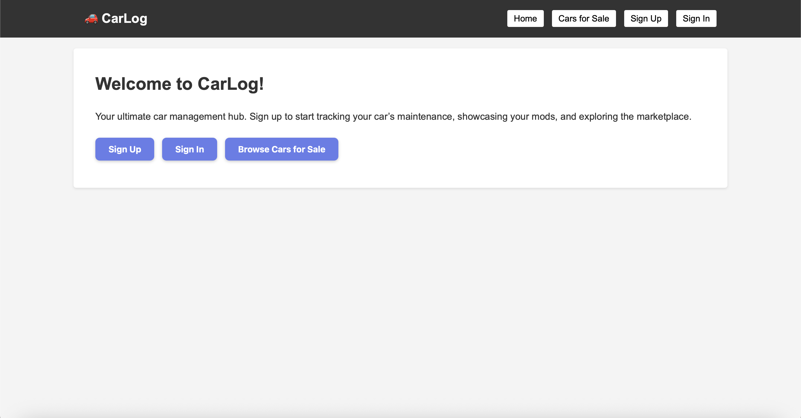

🚗 CarLog – Car Marketplace & Garage Manager

🕹️ Description

CarLog is a full-stack web application built with Node.js, Express, MongoDB, and EJS. Manage your car marketplace presence and personal vehicle garage all in one place! List cars for sale, track maintenance, document modifications, and connect with other car enthusiasts.

Features:

1. Complete car marketplace with listings and comments
2. Personal garage management system
3. Maintenance tracking with cost analysis
4. Modification documentation with categories
5. Image upload support
6. User authentication and access control

Getting Started

Run locally:
1. Clone the repository
2. Install dependencies: `npm install`
3. Set up MongoDB connection in `.env`
4. Start the server: `npm start`
5. Visit: http://localhost:3000

or from the deployed link: https://carlog-ahmed-2025-57171220c797.herokuapp.com

Planning Materials:
• [User Stories](#)
• [Database Schema](#)
• [Route Planning](#)

How to Use

1. **Sign Up/Login** to access the platform
2. **Browse Marketplace** to view cars for sale
3. **Add Your Cars** to the marketplace or personal garage
4. **Track Maintenance** records for your vehicles
5. **Document Modifications** and upgrades
6. **Comment & Connect** with other users

Technologies Used

• **Backend**: Node.js, Express.js, MongoDB, Mongoose
• **Frontend**: EJS, HTML5, CSS3, JavaScript
• **File Upload**: Multer
• **Authentication**: Express Sessions
• **Database**: MongoDB Atlas
• **Styling**: Custom CSS with Flexbox/Grid

📚 Attributions

• **Framework**: Express.js for backend architecture
• **Database**: MongoDB for data persistence
• **Styling**: Custom CSS with modern design principles
• **Inspired by**: Real-world car marketplace platforms
